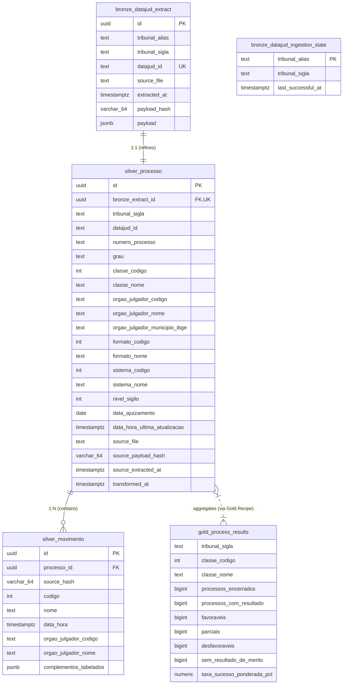

# Initial Data Dictionary — DataLaw

> **Document Status:** Active (Sprint 1 Baseline)  
> **System:** DataLaw Platform — Legal Business Intelligence & Indicators  
> **Primary Database:** PostgreSQL 18  
> **Architecture:** Medallion Pattern (*Raw*, *Bronze*, *Silver*, *Gold*)  
> **Release Date:** 2026-09-25  

---

## 1. Overview & Logical Architecture

The **DataLaw** Data Warehouse implements the **Medallion Architecture**, separating data into dedicated schemas within PostgreSQL according to refinement level, data integrity, and analytical consumption requirements:

- **Raw (Disk Storage):** Immutable, compressed (`.json.gz`) DataJud (CNJ) public API response pages.
- **Bronze (PostgreSQL - Schema `bronze`):** Document-oriented storage in `JSONB`, storing the latest extracted process state with cryptographic deduplication (`payload_hash`).
- **Silver (PostgreSQL - Schema `silver`):** Cleaned, conformed, and normalized relational model (3NF) separating case headers from historical movement records with foreign key constraints.
- **Gold (PostgreSQL - Schema `gold`):** High-performance analytical materializations serving frontend dashboards, calculating adherence, resolution outcomes, and procedural velocity.

### Entity-Relationship Diagram (ERD)

---

## 2. Global Standards & Conventions

1. **Surrogate Keys:** All transactional tables utilize `UUIDv4` as their primary key (`id`), avoiding centralized auto-increment bottlenecks.
2. **Natural / Business Keys:**
   - In Bronze and Silver: Uniqueness is enforced by the composite tuple `(tribunal_sigla, datajud_id)`.
   - In Silver Movements: Uniqueness is enforced by `(processo_id, source_hash)`.
3. **Cryptographic Change Detection:** `*_hash` fields store a **SHA-256** checksum (64-character hexadecimal `VARCHAR(64)`), computed over canonical JSON representations (deterministic key ordering, stripped whitespace).
4. **Timezone Handling:** All datetime fields are stored as `TIMESTAMPTZ` (*timestamp with time zone*) strictly normalized to **UTC**.
5. **Naming Conventions:** Strict `snake_case` in lowercase for all schemas, tables, and column names.

---

## 3. Raw Storage Layer (Disk System)

Raw files are archived prior to database insertion, providing an immutable audit trail and offline re-ingestion capabilities.

- **Path Pattern:** `data/raw/<tribunal_sigla>/ingestion_date=<YYYY-MM-DD>/run_id=<TIMESTAMP>-<HASH>/page-<PAGENUM>.json.gz`
- **Format:** Gzip-compressed JSON files (`.json.gz`).
- **Elasticsearch Response Structure:**
  - `took`: Search execution duration in milliseconds.
  - `timed_out`: Boolean timeout indicator.
  - `_shards`: Elasticsearch sharding metadata.
  - `hits.total.value`: Total number of matching cases.
  - `hits.hits[]`: Array containing raw Elasticsearch documents (`_id`, `_index`, `_source`).

---

## 4. Bronze Layer (PostgreSQL — Schema `bronze`)

The Bronze layer preserves the complete raw document payload for each unique case, updating only when the canonical payload hash changes.

### 4.1. Table: `bronze.datajud_extract`

Stores raw DataJud process payloads with hash-based deduplication.

| Column Name | Data Type | Nullable? | Key | Description |
| :--- | :--- | :---: | :---: | :--- |
| `id` | `UUID` | No | **PK** | Technical surrogate key generated via `uuid_generate_v4()`. |
| `tribunal_alias` | `TEXT` | No | - | API route identifier for the court (e.g. `api_publica_tjsp`). |
| `tribunal_sigla` | `TEXT` | No | **UK** | Standardized court acronym (e.g. `TJSP`, `TJMG`, `TJRJ`). |
| `datajud_id` | `TEXT` | No | **UK** | Unique process identifier assigned by the DataJud API (`_id` or `_source.id`). |
| `source_file` | `TEXT` | No | - | Relative path to the raw `.json.gz` file supplying this version. |
| `extracted_at` | `TIMESTAMPTZ` | No | - | UTC timestamp when the ingestion extraction was performed. |
| `payload_hash` | `VARCHAR(64)` | No | - | SHA-256 hash of the canonical JSON payload. Used for conditional upserts (`ON CONFLICT DO UPDATE WHERE payload_hash IS DISTINCT FROM`). |
| `payload` | `JSONB` | No | - | Complete raw `_source` JSON document from DataJud, including header, classes, subjects, and movement arrays. |

* **Constraints:**
  - `pk_bronze_datajud_extract`: `PRIMARY KEY (id)`
  - `uq_bronze_datajud_extract_tribunal_datajud_id`: `UNIQUE (tribunal_sigla, datajud_id)`

---

### 4.2. Table: `bronze.datajud_ingestion_state`

Maintains the high-water mark timestamp for incremental ingestion jobs.

| Column Name | Data Type | Nullable? | Key | Description |
| :--- | :--- | :---: | :---: | :--- |
| `tribunal_alias` | `TEXT` | No | **PK** | API endpoint alias (e.g. `api_publica_tjsp`). |
| `tribunal_sigla` | `TEXT` | No | - | Associated court acronym (e.g. `TJSP`). |
| `last_successful_at` | `TIMESTAMPTZ` | No | - | UTC timestamp of the last fully completed ingestion run. Serves as baseline for incremental syncs (applying a 48h overlap window). |

* **Constraints:**
  - `pk_bronze_datajud_ingestion_state`: `PRIMARY KEY (tribunal_alias)`

---

## 5. Silver Layer (PostgreSQL — Schema `silver`)

The Silver layer transforms raw JSON documents into a 3NF conformed model, handling type conversions, schema validation, and relational normalization.

### 5.1. Table: `silver.processo`

Normalized case entity containing legal procedural metadata, jurisdiction levels, and court assignments.

| Column Name | Data Type | Nullable? | Key | Description |
| :--- | :--- | :---: | :---: | :--- |
| `id` | `UUID` | No | **PK** | Surrogate unique key for the legal process. |
| `bronze_extract_id` | `UUID` | No | **FK, UK** | Foreign key referencing `bronze.datajud_extract(id)`. Strictly 1:1 (`ON DELETE CASCADE`). |
| `tribunal_sigla` | `TEXT` | No | **UK** | Jurisdiction court acronym (e.g. `TJSP`). |
| `datajud_id` | `TEXT` | No | **UK** | Original DataJud unique identifier. |
| `numero_processo` | `TEXT` | Yes | - | Standard CNJ single case number: `NNNNNNN-DD.AAAA.J.TR.OOOO`. |
| `grau` | `TEXT` | Yes | - | Instance level (e.g. `G1` = First Instance, `G2` = Appellate/Second Instance, `JE` = Special Small Claims). |
| `classe_codigo` | `INTEGER` | Yes | - | Numerical TPU procedural class code (e.g. `7` = Common Civil Procedure). |
| `classe_nome` | `TEXT` | Yes | - | Descriptive procedural class name. |
| `orgao_julgador_codigo` | `TEXT` | Yes | - | Unique identifier of the judging chamber or judicial unit. |
| `orgao_julgador_nome` | `TEXT` | Yes | - | Full name of the judging body (e.g. `1ª Vara Cível de São José dos Campos`). |
| `orgao_julgador_municipio_ibge`| `TEXT` | Yes | - | 7-digit IBGE municipal code of the judicial unit's location. |
| `formato_codigo` | `INTEGER` | Yes | - | Procedural medium format: `1` for Electronic, `2` for Physical. |
| `formato_nome` | `TEXT` | Yes | - | Textual format name (`Eletrônico` or `Físico`). |
| `sistema_codigo` | `INTEGER` | Yes | - | Source court computer system code (e.g. SAJ, PJe, Projudi, Eproc). |
| `sistema_nome` | `TEXT` | Yes | - | Source court software system name. |
| `nivel_sigilo` | `INTEGER` | Yes | - | Confidentiality level (`0` = Public, `>0` = Sealed/Under Court Secrecy). |
| `data_ajuizamento` | `DATE` | Yes | - | Initial distribution/filing date of the lawsuit. |
| `data_hora_ultima_atualizacao`| `TIMESTAMPTZ`| Yes | - | Timestamp of the most recent movement registered by the court. |
| `source_file` | `TEXT` | No | - | Raw origin file name. |
| `source_payload_hash` | `VARCHAR(64)` | No | - | Upstream Bronze payload hash for data lineage auditing. |
| `source_extracted_at` | `TIMESTAMPTZ` | No | - | Ingestion timestamp from the CNJ API. |
| `transformed_at` | `TIMESTAMPTZ` | No | - | UTC execution timestamp of this Silver transformation. |

* **Constraints:**
  - `pk_silver_processo`: `PRIMARY KEY (id)`
  - `fk_silver_processo_bronze_extract`: `FOREIGN KEY (bronze_extract_id) REFERENCES bronze.datajud_extract(id) ON DELETE CASCADE`
  - `uq_silver_processo_bronze_extract_id`: `UNIQUE (bronze_extract_id)`
  - `uq_silver_processo_tribunal_datajud_id`: `UNIQUE (tribunal_sigla, datajud_id)`

---

### 5.2. Table: `silver.movimento`

Stores the granular, deduplicated historical timeline of judicial movements and procedural orders.

| Column Name | Data Type | Nullable? | Key | Description |
| :--- | :--- | :---: | :---: | :--- |
| `id` | `UUID` | No | **PK** | Surrogate unique movement key. |
| `processo_id` | `UUID` | No | **FK, UK** | Foreign key to parent case `silver.processo(id)` (`ON DELETE CASCADE`). |
| `source_hash` | `VARCHAR(64)` | No | **UK** | SHA-256 hash of the canonical movement object, ensuring deduplication of repeated movements within the same payload. |
| `codigo` | `INTEGER` | Yes | - | Numerical TPU movement code (e.g. `22` = Final Closure, `219` = Favorable Merit Judgment). |
| `nome` | `TEXT` | Yes | - | Movement label (e.g. `Baixa Definitiva`, `Julgamento`). |
| `data_hora` | `TIMESTAMPTZ` | Yes | - | Registered date and time when the movement took place. |
| `orgao_julgador_codigo` | `TEXT` | Yes | - | Identifier of the judicial unit registering the movement. |
| `orgao_julgador_nome` | `TEXT` | Yes | - | Descriptive name of the acting judicial body. |
| `complementos_tabelados` | `JSONB` | Yes | - | Structured nested attributes (e.g. reason for dismissal, decision subtype). |

* **Constraints & Indexes:**
  - `pk_silver_movimento`: `PRIMARY KEY (id)`
  - `fk_silver_movimento_processo`: `FOREIGN KEY (processo_id) REFERENCES silver.processo(id) ON DELETE CASCADE`
  - `uq_silver_movimento_processo_source_hash`: `UNIQUE (processo_id, source_hash)`
  - `ix_silver_movimento_processo_data_hora`: `INDEX (processo_id, data_hora)`

---

## 6. Gold Layer (PostgreSQL — Schema `gold`)

The Gold layer houses physical analytical tables materialized via registered Python/SQL recipes ([`src/data_law/transformation/gold_recipes.py`](file:///C:/FATEC/DataLaw/src/data_law/transformation/gold_recipes.py)). Queries are pre-validated by [`pglast`](file:///C:/FATEC/DataLaw/src/data_law/transformation/gold.py) to enforce read-only isolation and schema safety.

### 6.1. Table: `gold.process_results`

Analytical mart computing weighted success rates and resolution volumes per procedural class.

| Column Name | Data Type | Nullable? | Description |
| :--- | :--- | :---: | :--- |
| `tribunal_sigla` | `TEXT` | No | Target court acronym (e.g. `TJSP`). |
| `classe_codigo` | `INTEGER` | Yes | TPU procedural class code. |
| `classe_nome` | `TEXT` | Yes | Procedural class name (grouping dimension). |
| `processos_encerrados` | `BIGINT` | No | Total count of closed cases whose terminal movement was final dismissal or archival (TPU `22` or `246`). |
| `processos_com_resultado` | `BIGINT` | No | Count of closed cases featuring a definitive merits judgment (TPU `219`, `220`, or `221`). |
| `favoraveis` | `BIGINT` | No | Favorable judgments (TPU `219` — Procedência, weight 1.0). |
| `parciais` | `BIGINT` | No | Partially favorable judgments (TPU `221` — Procedência em Parte, weight 0.5). |
| `desfavoraveis` | `BIGINT` | No | Unfavorable judgments (TPU `220` — Improcedência, weight 0.0). |
| `sem_resultado_de_merito` | `BIGINT` | No | Closed cases without an identified terminal merits ruling. |
| `taxa_sucesso_ponderada_pct` | `NUMERIC(5,2)` | Yes | Primary KPI: Weighted success percentage.  Formula: `ROUND(100 * AVG(peso_sucesso), 2)`. |

---

## 7. Regulatory Domain Codes (TPU / CNJ Standard)

### 7.1. Procedural Termination Movements
| TPU Code | Movement Label | Role in DataLaw Pipeline |
| :---: | :--- | :--- |
| **22** | Baixa Definitiva (Final Closure) | API extraction filter and case closure marker. |
| **246** | Arquivamento Definitivo (Final Archival) | API extraction filter and case closure marker. |

### 7.2. Merits Ruling Outcomes
| TPU Code | Movement Label | BI Classification | Outcome Weight |
| :---: | :--- | :---: | :---: |
| **219** | Procedência | Favorable | `1.0` (100%) |
| **221** | Procedência em Parte | Partial | `0.5` (50%) |
| **220** | Improcedência | Unfavorable | `0.0` (0%) |

---

## 8. Data Lineage Matrix

| Business Concept | Raw Layer | Bronze Layer | Silver Layer | Gold Layer |
| :--- | :--- | :--- | :--- | :--- |
| **Process Identifier** | `hits.hits[]._id` | `datajud_id` | `datajud_id` | *(Grouped by court)* |
| **CNJ Unified Number** | `_source.numeroProcesso` | `payload->>'numeroProcesso'` | `numero_processo` | *(Metric dimension)* |
| **Procedural Class** | `_source.classe.codigo` | `payload->'classe'->>'codigo'`| `classe_codigo`, `classe_nome` | `classe_codigo`, `classe_nome` |
| **Judicial Unit** | `_source.orgaoJulgador.nome` | `payload->'orgaoJulgador'->>'nome'` | `orgao_julgador_nome` | *(Filtering dimension)* |
| **Filing Date** | `_source.dataAjuizamento` | `payload->>'dataAjuizamento'` | `data_ajuizamento` | *(Duration calculation)* |
| **Movements** | `_source.movimentos[]` | `payload->'movimentos'` | `silver.movimento` | *(Outcome classification)* |
| **Success Rate (%)** | - | - | - | `taxa_sucesso_ponderada_pct` |

---
*This document satisfies requirements RNF01 and US1.7 of the Product Backlog.*
